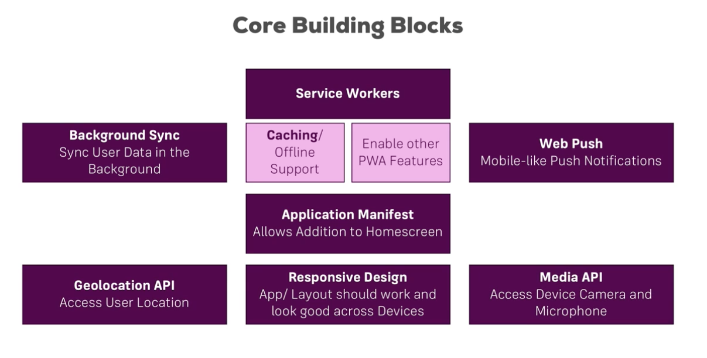

# Progressive Web App (PWA)
My notes on PWA. 

Tools that I might use :-
* Webpack
* Gulp
* Material Design
* JS
* EcmaScript6
* React/JSX
* Polymer 2.0

# Table of Content

### What feature of PWA?
* Reliable
* Fast
* Engaging

### Some stats
- on 2015, user spends 87% of time on native app and 13% on web app (source: comScore)
- user spend 80% of their time on top 3 used app on their phone
- Web has 2.5x reach of app

### Why traditional web does not overcome issue of user not using web app
* Push notification in native app pulls user back 
* Easier to start the app with native
* Access native device feature like camera
* Work Offline 

### Why not native app?
* Learn 2 languages
* Need multiple developer
* HTML, CSS, JS
* average installed app in phone is 0

### Quick start with PWA
use of service worker `navigator.serviceWorker.register('/sw.js');`

### Core Building Blocks of PWA
Core block ~

 

### Difference between SPA and PWA
SPA:
- Powered by JS
- Highly Reactive
- Only one HTML File sent to Browser

PWA
- Uses a lot of JS (Work without it too)
- Aims to have Reactivity
- Work with multiple file

### Progressive Enhancement the web app
- For old project, slowly implement some core PWA features
- For new project, fully implement PWA

### Downloadable PWA
use web manifest `manidest.json`

insert the manifest.json link in all html pages

`  <link rel="manifest" href="/manifest.json"> `

in [`manifest.json`](https://gist.github.com/superoo7/399b7646c10581eb3f03b59d80ac03d4.js)

### Adding support for Safari and IE
#### Safari on iOS
  	<!-- Apple Safari Setup -->
    <meta name="apple-mobile-web-app-capable" content="yes">
    <meta name="apple-mobile-web-app-status-bar-style" content="green">
    <meta name="apple-mobile-web-app-title" content="share-gram">
    <link rel="apple-touch-icon" href="/src/images/icons/apple-icon-57x57.png" sizes="57x57">
    <link rel="apple-touch-icon" href="/src/images/icons/apple-icon-60x60.png" sizes="60x60">
    <link rel="apple-touch-icon" href="/src/images/icons/apple-icon-72x72.png" sizes="72x72">
    <link rel="apple-touch-icon" href="/src/images/icons/apple-icon-76x76.png" sizes="76x76"> 
    <link rel="apple-touch-icon" href="/src/images/icons/apple-icon-114x114.png" sizes="114x114">
    <link rel="apple-touch-icon" href="/src/images/icons/apple-icon-120x120.png" sizes="120x120">
    <link rel="apple-touch-icon" href="/src/images/icons/apple-icon-144x144.png" sizes="144x144">
    <link rel="apple-touch-icon" href="/src/images/icons/apple-icon-152x152.png" sizes="152x152">
    <link rel="apple-touch-icon" href="/src/images/icons/apple-icon-180x180.png" sizes="180x180"

#### IE Support
    <!-- IE Support -->
    <meta name="msapplication-TitleImage" content="src/images/icons/app-icon-144x144.png">
    <meta name="msapplication-TitleColor" content="#fff">
    <meta name="theme-color" content="#3f51b5">

### Resources

